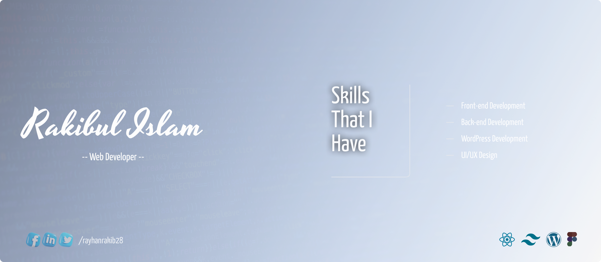

   

  

 

## :computer: Technologies that I know

 

  
  
  
  
  
  
  
  
  
  
  
  
  
  
  
  
  
  
  
  
  
  
  
  
  

## :chart_with_upwards_trend: Current Stats

 

  
  

## :eyes: Current overview

### 🔭 I’m student - At Programming Hero. 
### 🌱 I’m exploring - next.js Web Development. 
### 👯 I’m looking - To collaborate on open source projects. 

  

## :mailbox: Reach me out

 

 
 

 

